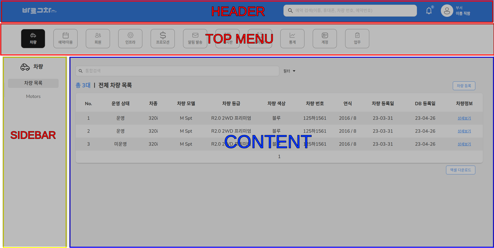

# Run project

Install mode module

```
npm install / yarn
```

Set endpoint API .env file

```
REACT_APP_BASE_URL=https://global3.hanbiro.com/ngw
```

Start developtment

```
npm run start
yarn start
```

The web browser auto open URL below
 http://localhost:3000/

# Build project

Run .py file build:

```
python3 deploy.py --id {ssh_id} --password {ssh_password}
python deploy.py --id {ssh_id} --password {ssh_password}
```

# Create new menu

1. Create new menu folder with require folders or Copy exist folder menu (Change folder name, route name...)
2. Add new menu in database (or add new menu in topMenuData in src/base/layouts/_mocks/menu.tsx if no api)
3. Define route menu & submenu in @{newmenu}/routes/Route.tsx
4. Define folder paths in config-overrides.js and tsconfig.json

*Related files:* src/base/layouts/_mocks/menu.tsx, @base/hooks/useMenu.tsx, src/base/store/atoms/menu.ts

# UI Component Using(Ant design)

Refer antd UI Components [https://ant.design/components/overview](https://ant.design/components/overview)

# Source organization & define

|              |                 |                     |                      |   | Description                                        |
| ------------ | --------------- | ------------------- | -------------------- | - | -------------------------------------------------- |
| source       |                 |                     |                      |   |                                                    |
|              | base            |                     |                      |   |                                                    |
|              |                 | assets              |                      |   |                                                    |
|              |                 |                     | fonts                |   | Define usage fonts                                |
|              |                 |                     | icons, images        | - | Define usage components icons, image               |
|              |                 | components          |                      | - | Commmon component                                  |
|              |                 |                     | GlobalStyles.css     | - | Define Global Style                                |
|              |                 | configs             |                      | - | Project config (Localization, Personal, Menus ...) |
|              |                 | constants           |                      | - | Project Contants                                   |
|              |                 | contexts            |                      |   |                                                    |
|              |                 |                     | AuthContext.tsx      | - | Authentication Context                             |
|              |                 | hooks               |                      | - | Common hooks (...)                                 |
|              |                 | layouts             |                      | - | Description of layouts                             |
|              |                 |                     | CommonLayout         | - | Layout before login (login / register page)        |
|              |                 |                     | MainLayout           | - | Layout after login (Top menu + pages..)            |
|              |                 | pages               |                      |   |                                                    |
|              |                 |                     | Auth                 | - | Login pages,                                       |
|              |                 | routes              |                      |   |                                                    |
|              |                 |                     | AuthorizedRoutes.tsx | - | All menus routers                                  |
|              |                 |                     | LoginRoutes.tsx      | - | Login routers                                      |
|              |                 |                     | index.tsx            |   |                                                    |
|              |                 | services            |                      | - | Define service call API                            |
|              |                 | store               |                      |   |                                                    |
|              |                 |                     | atoms                | - | Define atoms stores                                |
|              |                 | types               |                      | - | Define typescript Types                            |
|              |                 | utils               |                      | - | Common function                                    |
|              | {other menu...} | base's structure... |                      | - | Have structure like base                           |
|              |                 | containers          |                      |   |                                                    |
|              |                 |                     | MainContainer        | - | Wrapper all menu content                           |
| public       |                 |                     |                      |   |                                                    |
|              | .htaccess       |                     |                      |   |                                                    |
|              | index.html      |                     |                      |   |                                                    |
|              | favicon.svg     |                     |                      |   |                                                    |
|              | ...             |                     |                      |   |                                                    |
| node_modules |                 |                     |                      |   |                                                    |
|              | ...             |                     |                      |   |                                                    |

# Main Layout

***Related folder:*** src/base/layouts/MainLayout/


### Example:

```jsx
<div className={'right-tab-container'}>
  <Tabs />
</div>
```

```css
.right-tab-container .ant-tabs-tab {
  width: 142px;
  justify-content: center;
}

.right-tab-container .ant-tabs-top {
  height: 100%;
}
/* Can refer to more at: `src/base/components/View/TabView/index.tsx` */
```

- If using `.css` is absolutely necessary and there are no other options, consider using `styled-components`.

### Example:

```jsx
const CustomDefaultTabBar = styled(DefaultTabBar)`
    .ant-tabs-nav-wrap {
        padding-left: 20px;
        padding-right: 20px;
    }
    .ant-tabs-tab-btn {
        -webkit-user-select: none;
        -ms-user-select: none;
        user-select: none;
    }`;

return <CustomDefaultTabBar>
    {...}
</CustomDefaultTabBar>
```

## Common Component Styling

- All common components have their styles configured in the `mainLayoutAntdConfig` file located at:  
  `src/base/configs/index.ts`
- If you need to modify the styles of common components, make changes in this file. Be mindful to only update common components.
- If a design is consistent across all pages, it should be updated in this file.

## Styling for Individual Components

If a specific component requires styling, you should use the `ConfigProvider` component to define the styles:

```jsx
<ConfigProvider
    theme={{
        components: {
            Select: {
                /* Add tokens for your component here */
            },
            Switch: {
                /* Add tokens for your component here */
            },
            ...Other: { ... }
        },
        token: {
            /* Add global tokens here */
        },
    }}>
    {Your code}
</ConfigProvider>
```

For more details, refer to the `#Design Token` section in the Ant Design documentation: [Ant Design Select Component - Design Token](https://ant.design/components/select#design-token)

